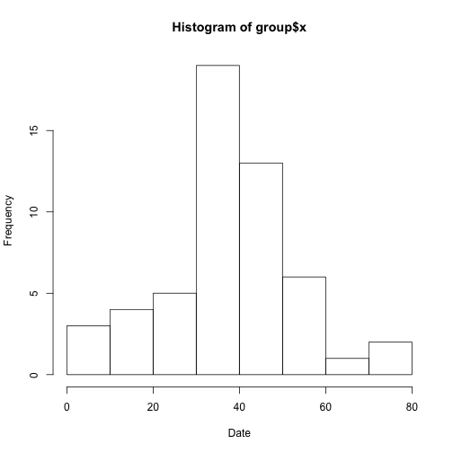
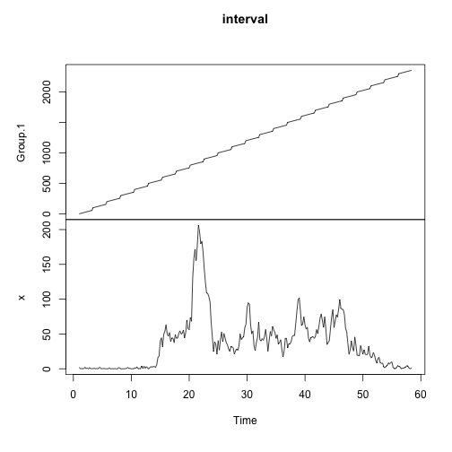
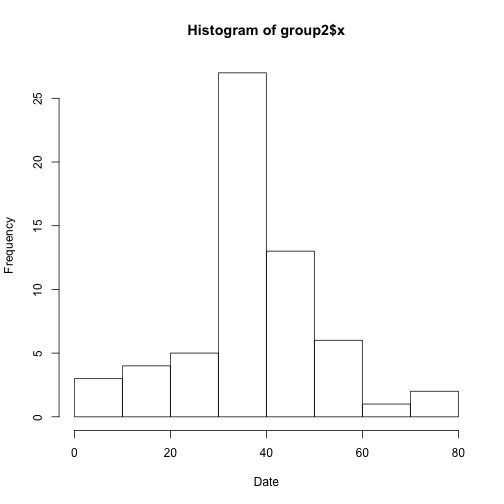
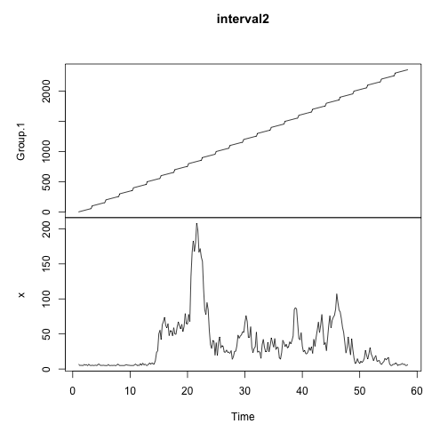

Loading and preprocessing the data


```r
activity <- read.csv("~/Downloads/activity.csv")
```

What is the mean total number of steps taken per day?  
Mean and Median of all days are calculated at the end.   

```r
sum(activity[,"steps"],na.rm = TRUE)
```

```
## [1] 570608
```

```r
group <- aggregate(activity$steps, by = list(activity$date), FUN = mean)
hist(group$x, xlab = "Date")
```

 

```r
mean(group$x,na.rm=TRUE)
```

```
## [1] 37.3826
```

```r
median(group$x, na.rm=TRUE)
```

```
## [1] 37.37847
```

What is the average daily activity pattern?  
Time Series Graph with Frequency of 5 is displayed at the end  
Max interval is displayed after the graph  

```r
interval <- aggregate(activity$steps, by = list(activity$interval), FUN = mean,na.rm=TRUE)
interval <- ts(interval, frequency = 5)
plot(interval)
```

 

```r
max(interval[,"x"])
```

```
## [1] 206.1698
```

```r
interval[which(interval[,"x"] == max(interval[,"x"]))]
```

```
## [1] 835
```

Imputing Missing Values  
Replaced missing value with global means of the entire dataset  

```r
length(activity[is.na(activity)])
```

```
## [1] 2304
```

```r
activity2 <- activity
activity2$steps[is.na(activity2$steps)] = mean(activity2$steps, na.rm=TRUE)
group2 <- aggregate(activity2$steps, by = list(activity2$date), FUN = mean)
hist(group2$x, xlab = "Date")
```

 

Weekday or weekends (graph reflects steps during the weekdays)  
Please note that graph in this section is different than the previous one.   

```r
activity2$weekday <- weekdays(as.Date(activity2$date))
activity2$weekdays <- ifelse(activity2$weekday == "Sunday" | activity2$weekday == "Saturday","Weekend", "Weekday")
activity3 <- activity2[which(activity2$weekdays == "Weekday"),]
interval2 <- aggregate(activity3$steps, by = list(activity3$interval), FUN = mean,na.rm=TRUE)
interval2 <- ts(interval2, frequency = 5)
plot(interval2)
```

 
